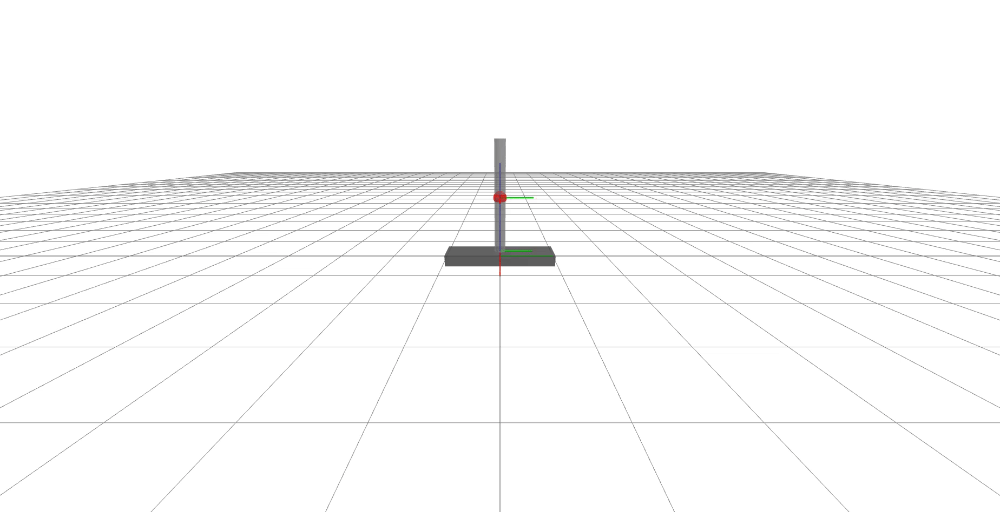
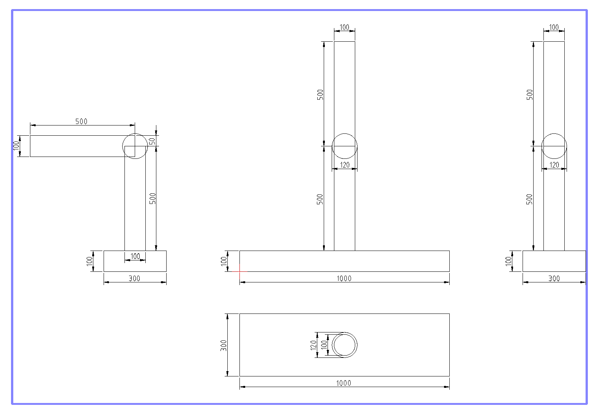
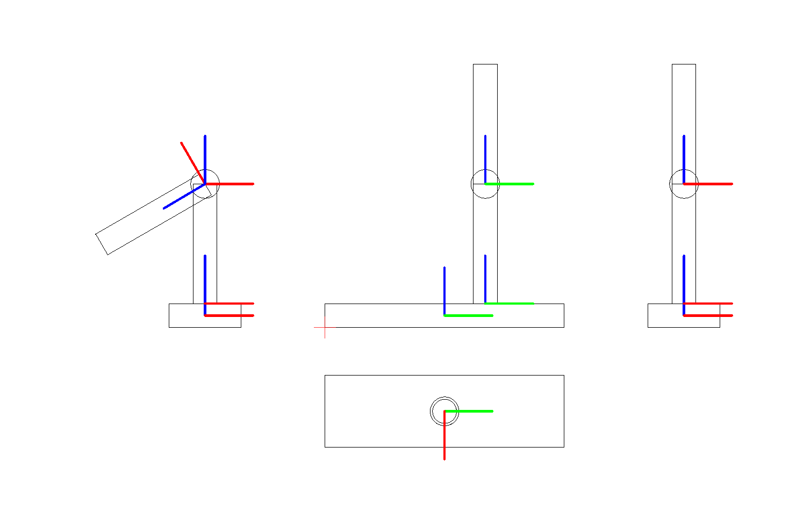

# Lab02 - Forward kinematics

The goal of this laboratory is twofold: (i) implement forward kinematics of the planar manipulator and (ii) create-and-animate urdf file that describes spatial robot.

## Forward kinematics of planar manipulator

Your goal is to implement forward kinematics for all links for a planar manipulator that is composed of revolute and prismatic joints.
The links frames are defined as follows:
 - the first frame is located in the base_pose of the robot,
 - for links attached to parent by revolute joints, the frame origin is at the end of the link with x-axis pointing in the direction of the link,
 - for links attached to parent by prismatic joints, the x-axis points in the direction of motion and the origin is located at the end of the link.

 The visualization of the frames created by `lab02/animate_robot_with_all_frames.py`:
 


## URDF
Your goal is to create an URDF file `exercises/lab02/robot_hw.urdf` with a description of spatial robot with 3 DoF.
The robot is made of the following links and joints:
 - a cuboid base,
 - prismatic joint in Y axis direction between the cuboid base and the following link,
 - fictional link without geometry for connecting two joints
 - revolute joint around Z axis between the prismatic joint and the following link,
 - cylinder link placed atop the cuboid base,
 - sphere link placed atop the cylinder link (connected to previous link by fixed joint),
 - revolute joint around X axis between the sphere link and the following link,
 - cylinder link connected to the sphere via aforementioned joint.

See the drawings bellow for the dimensions and animation of the expected structure.

 

Description of the robot dimensions in millimeters:
 

Positions of the frames of the links of the robot:
 


## Tests

Mandatory HW:
 - `robotics_toolbox/robots/planar_manipualator.py`
   - implement `fk_all_links` and `flange_pose` functions
 - `exercises/lab02/robot_hw.urdf`
   - create an URDF and store it in `exercises/lab02/` folder

If following tests will pass, your implementation is correct:
```bash
pytest tests/hw02/mandatory
```
